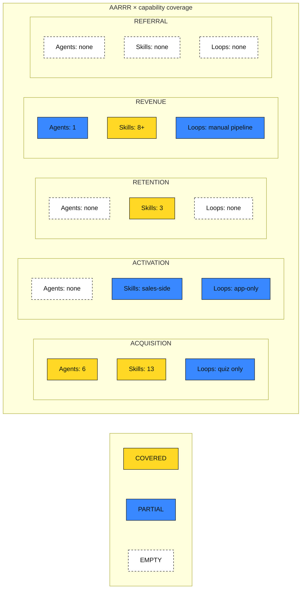

# 01 — AARRR Map (Phase 1)

**Source**: `_revenue-os/00-inventory.json` (441 records: 436 EVIDENCE, 5 GAP — all 5 binaries).
**Method**: first-principles mapping by verified function, never by name. Leaf assets (frameworks/templates/patterns/examples under a skill) inherit their parent capability's stage — they turn with the skill and have no independent AARRR existence. Every claim below is tagged.

---

## 1. Capability → AARRR mapping

### Skills (32)

| Capability (path prefix) | AARRR stage(s) | Rationale (verified function) | Tag |
|---|---|---|---|
| `plugins/growth-foundations/skills/icp-analysis` | ACQUISITION | Defines who to acquire; 0-100 scoring gates all downstream targeting; upstream hub of the plugin | EVIDENCE |
| `plugins/play-to-win/skills/icp-tal` | ACQUISITION | Target account list construction for outbound | EVIDENCE |
| `plugins/growth-foundations/skills/positioning` | ACQUISITION | Message strangers meet first; consumes ICP output | EVIDENCE |
| `plugins/growth-foundations/skills/competitive-analysis` | ACQUISITION | Landscape input to positioning | EVIDENCE |
| `plugins/play-to-win/skills/product-marketing` | ACQUISITION | GTM messaging/launch narrative | EVIDENCE |
| `plugins/motor-de-ofertas/skills/alma` | ACQUISITION (cross) | Brand character (ACF) used across all outbound copy | EVIDENCE |
| `plugins/growth-foundations/skills/content-strategy` | ACQUISITION | PENDIENTE content plan + TRIÁNGULO revenue-content model | EVIDENCE |
| `plugins/growth-foundations/skills/quiz-funnel` | ACQUISITION→ACTIVATION seam | SONDA quiz captures stranger → scored lead (first value = diagnosis) | EVIDENCE |
| `plugins/copywriting-engine/skills/headline-mastery` | ACQUISITION | First-touch copy | EVIDENCE |
| `plugins/copywriting-engine/skills/landing-pages` | ACQUISITION | Conversion of stranger → lead (VELO archetype) | EVIDENCE |
| `plugins/copywriting-engine/skills/email-sequences` | ACQUISITION→ACTIVATION seam | ORIGEN/PULSAR sequences nurture lead → first value | EVIDENCE |
| `plugins/copywriting-engine/skills/psychological-triggers` | CROSS (ACQ/ACT/REV) | Pattern library consumed by all copy production | EVIDENCE |
| `plugins/play-to-win/skills/pre-discovery-research` | ACQUISITION | Outbound account research before first touch | EVIDENCE |
| `plugins/motor-de-ofertas/skills/flujo` | ACQ→ACT→REV spine | Seven-phase funnel architecture spanning three stages | EVIDENCE |
| `plugins/motor-de-ofertas/skills/escala` | REVENUE | Value ladder = monetization/pricing architecture | EVIDENCE |
| `plugins/motor-de-ofertas/skills/funnel-optimization` | CROSS (seam optimizer) | Diagnoses conversion loss at any funnel seam | EVIDENCE |
| `plugins/sales-blueprint/skills/discovery-mastery` | ACTIVATION | PULSO discovery = first-value delivery in B2B motion | EVIDENCE |
| `plugins/play-to-win/skills/discovery-demo` | ACTIVATION | Demo-as-first-value orchestration | EVIDENCE |
| `plugins/play-to-win/skills/customer-journey` | ACTIVATION + RETENTION | Onboarding→adoption journey design (CICLO) | EVIDENCE |
| `plugins/play-to-win/skills/relationship-mapping` | ACTIVATION + REVENUE | Multithreading to power/champion for close | EVIDENCE |
| `plugins/sales-blueprint/skills/pipeline-management` | REVENUE | PULSO-based pipeline health/velocity | EVIDENCE |
| `plugins/sales-blueprint/skills/proposal-generation` | REVENUE | Proposal = pricing capture artifact | EVIDENCE |
| `plugins/play-to-win/skills/deal-strategy` | REVENUE | Win/loss strategy, deal qualification | EVIDENCE |
| `plugins/play-to-win/skills/advanced-techniques` | REVENUE | Negotiation/closing plays | EVIDENCE |
| `plugins/play-to-win/skills/renewal-expansion` | RETENTION + REVENUE | Renewal (retention) + expansion (revenue) split function | EVIDENCE |
| `plugins/play-to-win/skills/customer-success-ops` | RETENTION | CS operating model, health/churn management | EVIDENCE |
| `plugins/sales-blueprint/skills/coaching-cadence` | ENABLER (REV/RET) | Improves team capacity; owns no funnel stage directly | EVIDENCE |
| `plugins/play-to-win/skills/sales-transformation` | ENABLER (cross) | 90-day transformation sequencing of other skills | EVIDENCE |
| `os/skills/sales-orchestrator` | ACQ→ACT→REV pipeline | End-to-end deal pipeline (prospect→discovery→desk→follow) + VoC capture | EVIDENCE |
| `plugins/conversational-pm/skills/project-management` | OS INFRA (router) | Diagnoses need, routes to all 29 skills — serves every stage, owns none | EVIDENCE |
| `tools/ingestion-orchestrator` | OS INFRA | Content triage into the engine | EVIDENCE |
| `tools/plugin-factory` | OS INFRA | Meta-tool generating plugins | EVIDENCE |

### Agents (8)

| Agent | Stage | Rationale | Tag |
|---|---|---|---|
| `research-agent`, `insight-agent`, `ideation-agent`, `copy-output-agent` (copywriting-engine) | ACQUISITION | 4-phase copy production pipeline for first-touch assets | EVIDENCE |
| `funnel-architect` (motor-de-ofertas) | ACQ→ACT→REV spine | Integrates ESCALA+FLUJO+Alma into one funnel blueprint | EVIDENCE |
| `sdr-agent` (sales-blueprint) | ACQUISITION | Outbound prospecting motion | EVIDENCE |
| `deal-strategist` (sales-blueprint) | REVENUE | Deal-level strategy | EVIDENCE |
| `playbook-coach` (play-to-win) | ENABLER (REV/RET) | Problem→framework routing for team enablement | EVIDENCE |

### Commands (23)
Commands inherit the stage of the capability they orchestrate: `/icp` `/quiz` `/diagnostico` `/copy` `/headline` `/email-sequence` → ACQUISITION (+seam); `/discovery` `/kickoff` → ACTIVATION; `/pipeline` `/propuesta` `/deal-analysis` `/escala` → REVENUE; `/coaching` `/playbook` → ENABLER; `/funnel-diagnosis` → CROSS; `/os` `/roadmap` `/estado` → OS INFRA; 5 sales-orchestrator commands → ACQ→ACT→REV pipeline. [EVIDENCE]

### OS infrastructure (cross-stage services, not stage-owned)
`os/` (orchestrator protocol, phases, intake/GCO, governance constitution, framework registry, bridges, sync-engine, deck-generator) · `sdk-app/` (constitution runtime: trust graduation, budget breakers, quality gates; skill loader) · `supabase/` (orgs, diagnostic_results, ai_execution_logs, deliverables) · `src/` app (diagnostic→chat→deliverables runtime) · `docs/` (second-brain knowledge layer, template-catalog, execution-log) · `.claude/` hooks · root configs/readmes · `clients/` stubs. [EVIDENCE]

**Mapping rule for leaf records**: every inventory record under a capability prefix above inherits that row's stage. Verified programmatically — see §6.

---

## 2. Coverage grid: AARRR × {agents, skills, loops}

| Stage | Agents | Skills | Loops |
|---|---|---|---|
| **ACQUISITION** | **COVERED** — 6 (copy×4, sdr-agent, funnel-architect) | **COVERED** — 13 capabilities | **PARTIAL** — `/diagnostico` quiz→signup wired in app; no content-distribution or outbound loop runs anywhere |
| **ACTIVATION** | **EMPTY** — no onboarding/activation agent exists | **PARTIAL** — sales-side activation strong (discovery-demo, /kickoff, customer-journey); no product/service onboarding skill for the installed company's own clients | **PARTIAL** — app's diagnostic→first-deliverable flow works but only for this SaaS, and feeds nothing back |
| **RETENTION** | **EMPTY** — no CS/health agent | **COVERED** — customer-success-ops, renewal-expansion, customer-journey | **EMPTY** — no health-monitoring, re-engagement, or renewal-trigger loop exists anywhere |
| **REVENUE** | **PARTIAL** — deal-strategist only; no proposal/pricing agent | **COVERED** — strongest stage (8+ capabilities) | **PARTIAL** — sales-orchestrator pipeline is real end-to-end but manual and client-scoped (see §5 conflicts) |
| **REFERRAL** | **EMPTY** | **EMPTY** — zero referral/advocacy/case-study/testimonial capability in 441 files; only adjacent asset is VoC language-bank capture inside sales-orchestrator follow-up | **EMPTY** |

---

## 3. GAP records (per EMPTY/PARTIAL cell)

| # | Cell | Missing capability | Why the stage is incomplete without it | Tag |
|---|---|---|---|---|
| G1 | ACQ×Loops | No running content/outbound distribution loop — content-strategy produces plans, nothing executes or measures them | Acquisition depends on humans manually turning every asset; zero compounding | GAP |
| G2 | ACT×Agents | No onboarding/activation agent | First-value delivery for the installed company's clients is undesigned; activation is the funnel's highest-leverage seam | GAP |
| G3 | ACT×Skills | No client-onboarding skill (customer-journey covers design, not execution) | /kickoff exists for the call; nothing owns time-to-first-value after it | GAP |
| G4 | RET×Agents+Loops | No health-monitoring agent, no re-engagement/renewal-trigger loop | Retention skills are playbooks only; churn signals reach no one automatically | GAP |
| G5 | REV×Agents | No proposal/pricing agent (deal-strategist stops at strategy) | `/propuesta` is a red-zone command needing HITL — an agent seam is defined by the constitution but unstaffed | GAP |
| G6 | REV×Loops | Sales pipeline loop is manual and client-scoped | Revenue motion doesn't compound; every deal restarts from zero context except in `clients/kai-partners` paths | GAP |
| G7 | REF×all | Entire REFERRAL stage empty: no advocacy skill, no case-study engine, no referral loop | Customers generate no new customers; the flywheel has no fifth turn — confirmed across all 441 records | GAP |
| G8 | Instrumentation (cross) | Exit metrics (ICP>70, win-rate>30%, NRR>100%) and PULSO gates are documented, never measured — `ai_execution_logs` is read but never written | AARRR without instrumentation is a poster, not an OS | GAP |

---

## 4. Detected flywheels (existing and latent)

| # | Flywheel | State | Trigger → turning assets → compounding output → friction | Tag |
|---|---|---|---|---|
| F1 | **Diagnostic loop** | WIRED (partial) | Public `/diagnostico` → PULSO/PlainIQ scoring → signup → dashboard recommendations → skill chat → saved deliverable. Friction: app uses 7 hardcoded prompts, never loads the 29 marketplace skills or GCO; deliverables feed nothing back | EVIDENCE |
| F2 | **Sales pipeline loop** | MANUAL | Call booked → prospect→discovery→coach→desk→follow → VoC language bank → sharper prospecting copy. The only loop whose output already fuels its own next turn. Friction: human-turned at every step, hard-scoped to kai-partners | EVIDENCE |
| F3 | **Knowledge loop** | WIRED (degrading) | Write to docs/second-brain → PostToolUse hook → NLM upload → AI validation → backlog. Friction: backlog entries corrupting; validation output unparsed | EVIDENCE |
| F4 | **Trust-graduation loop** | CODED, UNFED | Skill executions → quality metrics in GCO → HITL→HOTL→HOOTL autonomy → more executions. Friction: nothing writes real execution data yet | EVIDENCE |
| F5 | **Template evolution loop** | MANUAL, SPARSE | Template run → execution-log append → 3 sub-benchmark runs flag review. Friction: log rarely fed | EVIDENCE |
| F6 | **Data flywheel** (deliverables/win-loss → ICP refinement → better targeting) | DOCUMENTED ONLY (doc-17, ai-factory-report) | Not built | GAP |

**PATTERN**: every wired loop lives in infrastructure; every revenue-touching loop is manual. The engine has reflexes but no metabolism.

---

## 5. GrowthOS ↔ AARRR overlap → extend-vs-standalone recommendation

| GrowthOS phase | AARRR coverage | Evidence |
|---|---|---|
| DEFINIR | ACQUISITION (targeting foundation) | activates icp-analysis, icp-tal, positioning, competitive-analysis, product-marketing, alma |
| ATRAER | ACQUISITION (≈1:1) | activates content-strategy, quiz-funnel, escala, flujo, headline-mastery, landing-pages |
| CONVERTIR | ACTIVATION + REVENUE (close) | activates 10 discovery/pipeline/proposal skills |
| ESCALAR | RETENTION + REVENUE (expansion) | activates cs-ops, renewal-expansion, coaching, transformation, journey, funnel-optimization |
| — | **REFERRAL: unowned by any phase** | zero activating skills exist |

**Recommendation (for operator decision): EXTEND GrowthOS.**
- 27 of 32 skills are already stage-routed through the 4 phases; a standalone AARRR layer would re-route the same skills — the parallel system the spec forbids. [EVIDENCE]
- GCO, constitution runtime, framework registry, and diagnostic router are load-bearing shared services a standalone OS would have to duplicate. [EVIDENCE]
- The Revenue OS delta is therefore: (a) a REFERIR capability (new 5th phase or ESCALAR extension — architecture decision), (b) an AARRR instrumentation layer over existing phase exit-metrics (G8), (c) loop closure for F2/F4/F5/F6, (d) reconnecting the app runtime to the marketplace content (F1 friction). [HYPOTHESIS — becomes the Phase 3 design brief if approved]

### Conflicts & defects surfaced (operator visibility, no action taken)
1. `os/skills/sales-orchestrator` sits in the generic engine but is hard-scoped `client: kai-partners` — violates the engine/client monorepo boundary. Options belong to Phase 3. [EVIDENCE]
2. App↔content disconnect: `src/` never reads SKILL.md, GCO, or os/ — two brains, one product. [EVIDENCE]
3. PULSO scale drift: canonical docs say 5-30, `pulso-schema.json` + E2E outputs use 0-50, sales-orchestrator uses 0-25. [EVIDENCE]
4. Incomplete SPICED→PULSO migration (sdr-agent, /pipeline, scoring-model, plugin.json keyword) + broken links in content-strategy SKILL.md + `clarq-schema.json` retired name. [EVIDENCE]
5. Near-duplicate frameworks: decision-criteria & "4 plays" duplicated across advanced-techniques/deal-strategy and relationship-mapping/icp-tal. [EVIDENCE]
6. Second-brain backlog corruption (F3 degradation). [EVIDENCE]

---

## 6. Cut list (assets mapping to no stage and no infra function)

| Path | Reason | Tag |
|---|---|---|
| `docs/dummy-auteco-spec-sheet.md` | Orphan fixture from reverted AUTECO demo | EVIDENCE |
| `scripts/generate_pitch.py`, `scripts/prototype_atomizer.js` | Reverted-demo leftovers, wired to nothing | EVIDENCE |
| `scripts/cli-stress-test.ts` | One-off test harness, no consumer | EVIDENCE |
| `src/app/page.tsx` (+ boilerplate assets) | Untouched create-next-app boilerplate at `/` | EVIDENCE |
| `docs/second-brain/24-*/25-*` fintech duplicate pair | Uncommitted near-duplicates breaking NN-numbering | EVIDENCE |
| 5 GAP binaries (favicon, 2 fonts, 2 mislabeled PDFs) | Non-capability assets | GAP |

Cut = flagged for operator decision; nothing is deleted in this phase.

---

## 7. Coverage verification
Verified programmatically against `00-inventory.json`: **441/441 records resolve to exactly one bucket — 223 capability, 213 OS-infra (incl. `package-lock.json` as root config), 5 cut list.** Zero unmapped. [EVIDENCE]
