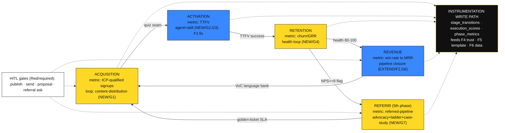

# 03 — Revenue OS Architecture (Phase 3)

**Inputs (complete evidence base)**: `_revenue-os/01-aarrr-map.md` (approved coverage map, gaps G1–G8, flywheels F1–F6, conflicts), `_revenue-os/02-research.md` (27 verified findings + 8 unresolved GAPs), `os/growthOS.md`, `os/intake/context-object.md`, `os/governance/agentic-constitution.md`, `os/naming/framework-registry.md`, `supabase/migrations/*`, repo skill/command conventions.

**Locked operator decisions** (non-negotiable, carried from the brief):
- **EXTEND GrowthOS** — no standalone parallel layer. Revenue OS = GrowthOS + REFERIR capability + AARRR instrumentation + loop closure + app↔content reconnection. (map §5 recommendation, confirmed)
- **Generic engine only** — no client content in the engine; `clients/<client>/` is the install point; client-scoped values become install variables. (CLAUDE.md monorepo pattern; map §5 conflict #1)
- **UpViral-style referral mechanics** = operator-directed design input: dual-sided incentives + milestone-unlock ladder + automation-on-threshold, tagged **OPERATOR-ASSERTED** where research (`02` G7) did not verify.

**Epistemic tags used throughout**: `[MAP §n]` = derived from approved coverage map · `[R:Gn]` = external research finding, gap n · `[REPO:path]` = verified repo evidence · `[OPERATOR-ASSERTED]` = operator design input, no external evidence · `[DESIGN]` = decision taken without external evidence (see §9).

---

## 1. Constraints (constraint-first)

### 1.1 Hard constraints (violating any = the design is wrong)

| # | Constraint | Source | Design implication |
|---|---|---|---|
| H1 | **Plugin/skill/command file structure**: `plugins/
/skills/<s>/SKILL.md` + `frameworks/`, `templates/`, `patterns/`, `examples/`; commands at `plugins/
/commands/<c>.md` | [REPO: CLAUDE.md Architecture; discovery-mastery, discovery.md] | Every NEW skill ships SKILL.md + subdirs; every NEW command ships a `.md` with frontmatter. No ad-hoc layouts. |
| H2 | **YAML frontmatter**: SKILL.md → `name`, `description` (with trigger phrases), `version`; commands → `description`, `argument-hint`, `allowed-tools`; plugin manifest → `name, version, description, author` only | [REPO: discovery-mastery/SKILL.md, discovery.md, CLAUDE.md Conventions] | Triggers live in `description`; `allowed-tools` gates side-effects (defence-in-depth for Red-zone commands). |
| H3 | **Spanish-first content** | [REPO: Constitution Art. II.3; CLAUDE.md] | All user-facing skill/command/template body copy in Spanish. This architecture doc is English (operator artifact); shipped assets are Spanish. |
| H4 | **Framework-registry naming**: any methodology name must exist in `os/naming/framework-registry.md`; unmapped third-party term = a bug | [REPO: framework-registry.md preamble] | New REFERIR frameworks must be **registered** before ship (new registry rows — see §2.5). Acronyms follow the Spanish-acronym pattern (PULSO/ESCALA/AVE). |
| H5 | **Agentic Constitution — zones + trust graduation**: every skill/command carries a Green/Yellow/Red zone; initial trust by zone (Green→HOTL, Yellow→HITL, Red→HITL-permanent); NEVER rules (no unsupervised external comms, no invented PULSO/financial metrics, brand safety, GCO isolation) | [REPO: constitution Art. I, III, V] | Each NEW component below declares its zone. External-comms steps (outreach, publish, referral asks) are **Red/HITL by construction** — cannot be graduated past HOTL for Tier-1/C-level (Art. I.1). |
| H6 | **GCO schema is the persistence contract**: per-client YAML at `~/.growthos/contexts/{company}.yaml`; extensions must be additive fields, not replacements; strict GCO isolation between clients | [REPO: context-object.md; constitution Art. I.2] | New state (health_score, ttfv, referral flags/ledger, execution scores) attaches as additive GCO fields **and** mirrors to Supabase (see H8). |
| H7 | **Supabase schema is the runtime store**: existing tables `organizations, profiles, diagnostic_results, ai_execution_logs, deliverables`, all RLS-scoped by `org_id` | [REPO: migrations 000000–000002] | Instrumentation adds tables that **FK to existing keys** and carry `org_id` on every row (RLS parity). No schema rewrites. |
| H8 | **Cloud Routines cannot read local files** (fresh clone, no permission prompts, ≥1h interval); Desktop tasks read local files at ≥1min; `/loop` is session-scoped | [R:G1 code.claude.com/scheduled-tasks] | **Any autonomous loop that needs client state must read it from Supabase, not `~/.growthos/contexts` YAML.** This forces the GCO→Supabase mirror (H6+H7) for every loop that a cloud Routine drives. Loops needing rich local content run as Desktop tasks. |
| H9 | **Budget guards**: session breaker at $2.00, daily default $10.00, Lean validation warning at $500 cumulative; every execution logs estimated cost | [REPO: constitution Art. VI] | Every NEW agent/loop logs `token_cost_usd` to `ai_execution_logs` and honors the breaker; scheduled loops declare a per-run budget (FutureSearch precedent: $5–8/run, [R:G1]). |
| H10 | **HITL at irreversible points only**: publish/send/spend gated; drafting/analytics auto | [R:G1 n8n, R:G5 stackai/agno] | Maps 1:1 to zones: draft/score/analyze = Green (auto); publish/outreach/proposal-send/referral-ask = Red (HITL). |

### 1.2 Soft constraints (preferences, overridable with cause)

| # | Constraint | Source | Note |
|---|---|---|---|
| S1 | One headline metric per stage; instrument Activation + Retention **first** | [R:G8 posthog/fatgraphs] | Preference on metric priority, not a schema limit — the pilot (§8) reconciles it. |
| S2 | Two-wave content (expensive model creates, cheap model repurposes); calendar-touch gate | [R:G1 doneyli] | Cost-optimization preference for the distribution loop, not required for correctness. |
| S3 | PR-as-approval-queue for autonomous drafts (git-native) | [R:G1 FutureSearch] | Fits this repo; alternative is an in-app review queue. |
| S4 | Non-cash, relationship-scaled B2B referral incentives | [R:G7 customergauge] | Strong preference; the incentive-bank template defaults to non-cash but is client-configurable. |
| S5 | `execution_scores` populated by human annotation, code rules, or LLM-as-judge | [R:G8 langfuse/langsmith] | Implementation choice per score key; all three sources allowed. |

### 1.3 Conflicts resolved (explicit priority)

| Conflict | Resolution (priority) | Rationale |
|---|---|---|
| S1 (instrument Activation+Retention first) **vs** pilot on REVENUE (§8) | **Ship the instrumentation layer first** (satisfies S1's schema intent), then close the REVENUE loop on top of it. Activation/Retention metric rows are provisioned empty in the same migration and populated next. | S1 is about metric *priority within a full analytics build*; it does not dictate which *loop* to build first when asset coverage is uneven [MAP §2]. The instrumentation is stage-agnostic and shared. |
| H8 (cloud Routines can't read GCO YAML) **vs** H6 (GCO is the persistence contract) | **GCO YAML stays the source of truth for rich/local content; a Supabase mirror carries loop-critical state.** | Both hold: additive GCO fields (H6) + a thin projection into Supabase tables (H7) that Routines can read (H8). No duplication of authority — Supabase mirrors, GCO owns. |
| Generic-engine rule **vs** `os/skills/sales-orchestrator` hard-scoped `client: kai-partners` | **De-scope to install variables** (F2/G6 fix, §3.4). Client stays as an install of `clients/kai-partners/`. | Locked operator decision + map §5 conflict #1; G6 needs no research [R:G6]. |
| REFERIR as ESCALAR extension **vs** new 5th phase | **New 5th GrowthOS phase REFERIR** (§2.5). | Gives 1:1 AARRR↔phase mapping (5 stages = 5 phases), keeps one-metric-per-phase clean, and respects REFERIR's distinct trigger (ESCALAR+NPS≥9) and 60–90d ramp [R:G7] that would pollute ESCALAR's exit criteria (NRR>100%, churn<10%) [REPO: escalar.md]. Tradeoff: GrowthOS is documented 4-phase everywhere — this is the largest doc change and is flagged [DESIGN]. |
| PULSO scale drift (5-30 / 0-50 / 0-25) [MAP §5 conflict #3] | **Out of scope for this architecture; flagged to instrumentation.** `stage_transitions.metric_value` stores the raw score + a `scale` tag so drift is observable, not silently averaged. | Fixing the canon is a separate cleanup; the OS must not average across incompatible scales. |

---

## 2. Per-AARRR-stage target set

Legend: **REUSE** = existing asset, unchanged · **EXTEND** = existing asset + delta · **NEW** = no existing asset covers it (checked against [MAP §1] capability table; duplication = failure).

Every stage names **one headline metric** [R:G8 S1]. Activation + Retention are instrumented first [S1].

### 2.1 ACQUISITION — headline metric: **ICP-qualified signups** [R:G8 posthog]

| Element | Tag | Path / Justification |
|---|---|---|
| research-agent, insight-agent, ideation-agent, copy-output-agent | REUSE | `plugins/copywriting-engine/agents/*` — 4-phase first-touch copy pipeline [MAP §1 Agents] |
| sdr-agent | REUSE | `plugins/sales-blueprint/agents/sdr-agent.md` — outbound motion (needs SPICED→PULSO sweep, conflict #4, but capability exists) |
| funnel-architect | REUSE | `plugins/motor-de-ofertas/agents/funnel-architect.md` — ESCALA+FLUJO+Alma blueprint |
| icp-analysis, icp-tal, positioning, competitive-analysis, product-marketing, alma, content-strategy, quiz-funnel, headline-mastery, landing-pages, email-sequences, psychological-triggers, pre-discovery-research, flujo | REUSE | 14 acquisition-stage skills already exist and are phase-routed via DEFINIR+ATRAER [MAP §1; growthOS.md] |
| **Content-distribution loop** (G1) | NEW (loop) | No running distribution/outbound loop exists [MAP §2 ACQ×Loops PARTIAL, G1]. Built as: **EXTEND `content-strategy`** (add an execution contract to the existing PENDIENTE plan) + **NEW scheduled routine + `learnings.md`** (FutureSearch/doneyli pattern [R:G1]). See §3.1. |
| `/distribuir` command + PostToolUse hook | NEW (command) | Orchestrates the loop; `allowed-tools` excludes send/publish (Red gate). Publish step opens a PR/review queue, never auto-sends [R:G1, H10]. |

**No new acquisition skills** — the 14 existing cover targeting, messaging, and content production; the gap is *execution + measurement*, which is a loop, not a skill [MAP §2].

### 2.2 ACTIVATION — headline metric: **Time-To-First-Value (TTFV)** [R:G2/G3 rocketlane], instrumented first [S1]

| Element | Tag | Path / Justification |
|---|---|---|
| discovery-mastery, discovery-demo | REUSE | `plugins/sales-blueprint/...`, `plugins/play-to-win/...` — first-value in the sales motion [MAP §1] |
| customer-journey | REUSE | `plugins/play-to-win/skills/customer-journey` — journey **design** (CICLO) [MAP §1] |
| quiz-funnel (ACQ→ACT seam) | REUSE | first value = diagnosis [MAP §1] |
| **activation-agent** (G2) | NEW (agent) | ACT×Agents is EMPTY [MAP §2, G2]. Owns the 4-condition activation contract: scope sign-off + first quick win (day 3–5) + recurring cadence + KPIs aligned [R:G2/G3 unkoa]. Zone: **Yellow/HITL** (client-facing onboarding decisions). |
| **client-onboarding** skill (G3) | NEW (skill) | customer-journey designs the journey but nothing **executes** TTFV after `/kickoff` [MAP §2 ACT×Skills PARTIAL, G3]. NEW skill = execution layer over the existing 90-day roadmap output, with dated 30-60-90 gates (day 3–4 dependency check, day 7 CSAT) [R:G2/G3 rocketlane+unkoa]. Placement: extends play-to-win (owns customer-journey). Zone: **Yellow**. |
| **Activation loop** | NEW (loop) built on **EXTEND F1** | Reconnect app runtime → marketplace content + GCO (F1 friction, §3.5) so the diagnostic→first-deliverable flow feeds TTFV back. Copilot→autonomous graduation with replay-on-historical as the promotion test [R:G2/G3 eesel] maps directly onto constitution Art. V. See §3.2. |

### 2.3 RETENTION — headline metric: **Gross churn / GRR** [R:G8 fatgraphs, gate GRR<85%→stop], instrumented first [S1]

| Element | Tag | Path / Justification |
|---|---|---|
| customer-success-ops, renewal-expansion, customer-journey | REUSE | 3 retention skills exist [MAP §2 RET×Skills COVERED]. No new retention skills. |
| **health-monitor agent** (G4) | NEW (agent) | RET×Agents EMPTY [MAP §2, G4]. Computes a 0–100 health score, four action bands (80–100 expansion play, 60–79 friction review, 40–59 recovery, 0–39 intervention) [R:G4 Pylon]. For services firms with no telemetry, weight relationship signals: meeting cadence (Fireflies bridge exists [REPO: os/bridges]), response latency, CSM Pulse [R:G4 Gainsight/Vitally]. Zone: **Green** scoring / **Yellow** intervention. |
| **Health-score retention loop** (G4) | NEW (loop) | No health/re-engagement/renewal-trigger loop exists anywhere [MAP §2 RET×Loops EMPTY, G4]. Delta-based triggers (alert on score *drops*, not just absolutes — suits low volume [R:G4 Vitally]) fire renewal-expansion / re-engagement commands per band. CSM Pulse = weekly 1-question founder check-in (human signal first-class). See §3.3. |

### 2.4 REVENUE — headline metric: **Win rate (>30%) → MRR** [R:G8 posthog + unusual.vc]

| Element | Tag | Path / Justification |
|---|---|---|
| pipeline-management, proposal-generation, deal-strategy, advanced-techniques, escala, relationship-mapping | REUSE | Strongest stage, 8+ capabilities [MAP §2 REV×Skills COVERED] |
| deal-strategist | REUSE | `plugins/sales-blueprint/agents/deal-strategist.md` [MAP §1] |
| **proposal-pricing agent** (G5) | NEW (agent) | deal-strategist stops at strategy; `/propuesta` is Red-zone and the agent seam is *defined by the constitution but unstaffed* [MAP §2 REV×Agents PARTIAL, G5; constitution Art. III `/propuesta`=Red]. Emits an **evidence pack** (pricing rationale, deal context, diff vs pricing-grid) decidable in seconds, with **approve-with-edits / review-and-edit** so a human adjusts price and the agent continues [R:G5 stackai/agno/langgraph]. Zone: **Red/HITL** (irreversible client-facing document). |
| **Sales-pipeline loop closure** (F2/G6) | EXTEND | Genericize `os/skills/sales-orchestrator` (currently `client: kai-partners`, [REPO: SKILL.md frontmatter]) — de-scope hard paths to install variables [R:G6 = repo-sufficient, no research]. This is the **only loop whose output already fuels its next turn** (VoC language bank → sharper prospecting) [MAP §4 F2]. See §3.4. |

### 2.5 REFERRAL / REFERIR — headline metric: **Referred-pipeline generated** (ramp: first activity 60–90d, revenue 3–6mo) [R:G7 customergauge]

**Phase decision [DESIGN, conflict-resolved §1.3]**: REFERIR is a **new 5th GrowthOS phase** following ESCALAR, not an ESCALAR sub-mode. New plugin **`motor-de-referidos`** (mirrors `motor-de-ofertas` naming) houses its skills.

| Element | Tag | Path / Justification |
|---|---|---|
| **referral-advocacy agent** (G7) | NEW (agent) | REF×Agents EMPTY; zero referral capability in 441 files [MAP §2/§1, G7]. Orchestrates advocacy scoring → ladder → case study → golden-ticket handoff. Zone: **Red/HITL** for any outreach (Art. I.1). |
| **advocacy-scoring** skill | NEW (skill) | No advocacy/NPS-tiering capability exists [MAP §1]. **Reuses PULSO's scoring-model pattern** (0–100 scoring → tiers) applied to NPS: 9–10 promoters = referral-eligible, segment before outreach, never broadcast [R:G7 zonkafeedback]. Zone: **Green** (formulaic scoring). |
| **referral-ladder** skill | NEW (skill) | Milestone-unlock ladder: **1 referral = case-study feature, 3 = discounted engagement, 5 = co-marketing partner**; dual-sided incentive; automation-on-threshold [OPERATOR-ASSERTED, UpViral input; R:G7 partial]. Non-cash, relationship-scaled incentives from a per-client incentive-bank [R:G7 customergauge, S4]. Zone: **Yellow** design / **Red** reward-delivery+outreach. |
| **case-study-engine** skill | NEW (skill) | Distinct from the sales follow-up VoC capture [MAP §1 note]. Triggers on ESCALAR milestone completion; captured after proven usage, asked by a non-seller party, video fast [R:G7 napierb2b]. Zone: **Yellow** (client asset, brand review). |
| **REFERIR loop** (G7) | NEW (loop) | Trigger → ladder → asset → golden-ticket handoff SLA (same/next business day or leads go cold [R:G7 customergauge]) → feeds ACQUISITION. See §3.6. |
| Incentive-bank template | NEW (template) | Per-client `clients/<client>/referral/incentive-bank.md`, mirrors existing pricing-grid pattern [R:G7; REPO: kai pricing-grid]. |
| `/referir` command | NEW (command) | Orchestrates the phase; outreach steps `allowed-tools`-gated to draft-only. |

**Framework-registry additions required [H4]** (register before ship): `REFERIR` (phase), `ESCALERA DE REFERIDOS` (milestone-unlock ladder, mirrors ESCALA), and an advocacy index name (proposed **IMPULSO** — Índice de Promotores, [DESIGN, name pending registry approval]).

---

## 3. Flywheel designs

Each loop: **trigger → turning assets → compounding output → friction (and its fix)**. Palette-conformant diagram in §7.

### 3.1 F-ACQ — Content-distribution loop (closes G1) — NEW
- **Trigger**: scheduled Desktop task (weekday cadence, FutureSearch precedent) OR calendar-touch gate — if the human hasn't touched the content calendar, the producer does nothing [R:G1 doneyli].
- **Turning assets**: `content-strategy` PENDIENTE plan + TRIÁNGULO DE INGRESOS (REUSE) → two-wave production (expensive model creates, cheap model repurposes [S2]) → classifier/scorer (1–5 rubric [R:G1 FutureSearch]) → PR / review queue.
- **Compounding output**: self-updating `learnings.md` drops dead channels, doubles down on winners [R:G1]; published content → ICP-qualified signups (headline metric) via `diagnostic_results`.
- **Friction (current → fix)**: no execution/measurement today [MAP §2]. **Fix**: Desktop task (not cloud Routine — needs local content [H8]); publish is Red/HITL via PR-as-approval [H10, S3]; per-run budget cap [H9].
- **Unresolved**: closed-loop content→revenue attribution has no credible source [R:G1 GAP] → treated as [DESIGN] (§9).

### 3.2 F-ACT — Activation loop + F1 repair (closes G2/G3, fixes F1) — NEW + EXTEND
- **Trigger**: `/kickoff` completion (kickoff-call date = TTFV clock start [R:G2/G3]).
- **Turning assets**: activation-agent runs the 4-condition contract [R:G2/G3 unkoa]; client-onboarding skill executes dated 30-60-90 gates over the existing 90-day roadmap.
- **Compounding output**: TTFV trend (headline metric) written to `stage_transitions` + GCO; successful activation seeds the RETENTION health baseline (chain seam, §5).
- **Friction (current → fix)**: F1 — the app never reads SKILL.md/GCO/os (two brains) [MAP §4 F1, conflict #2]. **Fix (F1 repair)**: app runtime loads the marketplace skills + GCO instead of 7 hardcoded prompts (§3.5); copilot→autonomous graduation gated by replay-on-historical [R:G2/G3 eesel] via constitution Art. V.

### 3.3 F-RET — Health-score retention loop (closes G4, feeds F4) — NEW
- **Trigger**: nightly/weekly health recompute; **delta alert on score drop** [R:G4 Vitally].
- **Turning assets**: health-monitor agent scores 0–100 from relationship signals (meeting cadence via Fireflies bridge, response latency, CSM Pulse) [R:G4 Gainsight]; band router fires renewal-expansion / re-engagement commands (REUSE).
- **Compounding output**: churn/GRR (headline metric) + NPS; NPS≥9 sets the REFERIR trigger flag (chain seam, §5); every intervention writes an `execution_scores` row → **feeds F4 trust graduation** (§3.7).
- **Friction (current → fix)**: no health loop exists [MAP §2 G4]; cloud Routine can't read GCO YAML [H8]. **Fix**: health state mirrored to Supabase (`health_scores` projection) so a Routine can read it (§1.3); no telemetry → relationship-weighted score [R:G4].
- **Unresolved**: no source for low-volume (5–20 client) services health design [R:G4 GAP] → band thresholds are [DESIGN] (§9), validated by dog-fooding.

### 3.4 F-REV — Sales-pipeline loop closure (closes F2/G6) — EXTEND
- **Trigger**: call booked → `prospect → discovery → coach → desk → follow` [REPO: sales-orchestrator].
- **Turning assets**: existing 4-phase pipeline + proposal-pricing agent (G5) at the desk stage; VoC language-bank capture at follow.
- **Compounding output**: VoC language bank → sharper prospecting copy (already turns [MAP §4 F2]); win/loss → `stage_transitions` (win-rate) → **feeds F6 data flywheel** (§3.8) → ICP refinement.
- **Friction (current → fix)**: human-turned at every step AND hard-scoped to `clients/kai-partners` [MAP §4 F2, §5 conflict #1]. **Fix (G6)**: de-scope `client: kai-partners` frontmatter + hard paths → install variables (pricing-grid, brand-ref, deal dir become `clients/<client>/...` install points); no research needed [R:G6]. Proposal send stays Red/HITL [G5].

### 3.5 F1 detail — App↔content reconnection (fixes F1 friction) — EXTEND
- **Problem**: `src/` never reads SKILL.md, GCO, or `os/` — two brains, one product; app uses 7 hardcoded prompts [MAP §4 F1, §5 conflict #2].
- **Fix**: the `/api/chat` + `/ejecutar/[skill]` runtime resolves skills via the `sdk-app` skill loader (`sdk-app/src/core/skills`) and hydrates from the GCO (mirrored to Supabase for the web runtime [H8]); deliverables write back to `deliverables` + GCO `outputs`. This single reconnection is the prerequisite that makes F-ACT, instrumentation writes, and F4 real (currently `ai_execution_logs` is read but never written [MAP §4 F4/G8]).

### 3.6 F-REF — REFERIR loop (closes G7, new engine turn) — NEW
- **Trigger**: GCO flag `referral_ready` fires when phase ∈ {ESCALAR, REFERIR} **and** (NPS≥9 **or** milestone complete) — peak-satisfaction, never at contract end [R:G7 zonkafeedback].
- **Turning assets**: advocacy-scoring (promoter tiering) → referral-ladder (milestone-unlock, dual-sided) → case-study-engine → golden-ticket handoff.
- **Compounding output**: referred leads (~4× conversion, larger purchases [R:G7 influitive]) enter ACQUISITION intake via an SLA-timed handoff (same/next day [R:G7]); automation-on-threshold — a Supabase trigger fires asset generation when referral count crosses a ladder rung [OPERATOR-ASSERTED; R:G7 upviral partial].
- **Friction (current → fix)**: entire stage empty [MAP §2 G7]; outreach is irreversible external comms. **Fix**: all asks/rewards Red/HITL (Art. I.1); ramp expectation copied into `/roadmap` so the loop isn't scored "failed" inside 90 days [R:G7].
- **Unresolved**: UpViral revenue-email sequencing unverified [R:G7 GAP, OPERATOR-ASSERTED]; no B2B champion-program ROI numbers [R:G7 GAP] → §9.

### 3.7 F4 — Trust-graduation loop (closes F4 UNFED) — EXTEND
- **Fix**: F4 was "CODED, UNFED — nothing writes real execution data" [MAP §4 F4]. Once F1 is repaired (§3.5) and instrumentation lands (§6), every skill run writes `ai_execution_logs` + `execution_scores`; the constitution's HITL→HOTL→HOOTL criteria (Art. V: >50 tasks, >95% match, Founder-Free Test) read those aggregates from GCO `quality_metrics`. The loop turns because it is finally fed.

### 3.8 F5 + F6 — Template-evolution + Data flywheel (closes F5, builds F6) — EXTEND + NEW
- **F5 (EXTEND)**: template run → `docs/execution-log.md` append → 3 sub-benchmark misses flag review in `docs/template-catalog.md` [MAP §4 F5; CLAUDE.md Template Protocol]. Fix: the app runtime auto-appends the log on each templated execution (currently manual/sparse), driven by the same write path as F4.
- **F6 (NEW)**: deliverables + win/loss → ICP refinement → better targeting [MAP §4 F6, doc-17]. Built from `stage_transitions` (win-rate by ICP segment) + `execution_scores` joined to `deliverables`; feeds icp-analysis re-scoring. This is the data flywheel the map calls "documented only".

### 3.9 One engine — how loops chain across seams (§5 detail)
See §5 for the seam table and the chaining narrative. In short: the five stage loops (§3.1–3.6) chain rim-to-rim, and four meta-loops (F3 knowledge, F4 trust, F5 template, F6 data) turn underneath, all fed by the single instrumentation write path (§6). "The engine has reflexes but no metabolism" [MAP §4] — this architecture supplies the metabolism (the write path) so every reflex now compounds.

---

## 4. HITL seams (constitution zones × research patterns)

| Seam | Stage | Zone | Gate mode | Human action | Evidence |
|---|---|---|---|---|---|
| Publish content | ACQ | Red | `required` (blocks) | Approve/edit via PR queue | Art. I.1; [R:G1 FutureSearch/n8n]; H10 |
| Outbound send (SDR) | ACQ | Red | `required` | Approve before send | Art. I.1; conflict #4 note |
| Activation decisions | ACT | Yellow→(HOTL after replay) | `audit` post-graduation | Accept/edit/reject; replay-on-historical to promote | Art. V; [R:G2/G3 eesel] |
| Health intervention | RET | Yellow | `required` for outreach, `audit` for scoring | Weekly CSM Pulse (1 question); approve re-engagement | Art. III; [R:G4 Vitally] |
| **Proposal / pricing** | REV | **Red** | `required` + **evidence pack + approve-with-edits** | Adjust price, agent resumes (review-and-edit) | Art. III `/propuesta`=Red; [R:G5 stackai/agno/langgraph] |
| Referral ask / reward delivery | REF | Red | `required` | Approve every ask (external comms) | Art. I.1; [R:G7] |
| Case-study publish | REF | Yellow | `required` | Brand + client sign-off | Art. I.4; [R:G7 napier] |

**Gate-mode encoding [R:G5 agno]**: `required` = blocks execution (Red/Yellow-irreversible); `audit` = logs post-hoc (Green/graduated). This is the runtime form of the Green/Yellow/Red zones — no new governance, just an execution binding of the existing constitution.

---

## 5. Loop chaining — the seams (one engine)

| Seam (loop→loop) | Carrier | Mechanism |
|---|---|---|
| REFERIR → ACQUISITION | Golden-ticket handoff | Referred lead enters ICP-scored intake, SLA same/next day [R:G7]; ~4× conversion |
| ACQUISITION → ACTIVATION | quiz-funnel seam | Scored lead → first value = diagnosis [MAP §1] |
| ACTIVATION → RETENTION | TTFV success | Activated client seeds health baseline [R:G2/G3] |
| RETENTION → REFERIR | NPS≥9 flag | `referral_ready` set at peak satisfaction [R:G7] |
| RETENTION → REVENUE | Expansion band | Health 80–100 → expansion play [R:G4 Pylon] |
| REVENUE → ACQUISITION | VoC language bank | Win/loss language → prospecting copy [MAP §4 F2] |
| ALL → meta-loops | Instrumentation write path (§6) | Every run feeds F4 (trust), F5 (template), F6 (data) |

Narrative: a closed customer at high health (RET) becomes a promoter (REFERIR), whose referral enters ACQUISITION pre-warmed, activates faster (ACT) because the app now reads its own skills (F1 fix), converts (REV) with a VoC bank sharpened by the last deal, and returns to RET — while every turn writes scores that graduate trust (F4), evolve templates (F5), and refine the ICP (F6). Five rim loops, four hub loops, one write path.

---

## 6. Instrumentation layer (minimal, G8)

Principle [R:G8]: `ai_execution_logs` (tokens/latency) can **never** satisfy G8 — OpenTelemetry GenAI conventions explicitly exclude business outcomes [R:G8 opentelemetry]. An outcome layer is required. Keep it minimal: **stage-transition events + execution_scores + one metric per stage**.

### 6.1 New Supabase migrations (follow existing `20260320000NNN_*.sql` convention, RLS by `org_id`)

| Migration | Table | Shape | Source |
|---|---|---|---|
| `20260320000003_stage_transitions.sql` | `stage_transitions` | `id, org_id, from_stage, to_stage, headline_metric_key, metric_value numeric, scale text, occurred_at` — small enum of AARRR/phase stages; `org_id` on every row (=`groupId`) | Segment B2B-SaaS + unusual.vc: low-volume funnels = named stage transitions, one count each [R:G8] |
| `20260320000004_execution_scores.sql` | `execution_scores` | `id, execution_id FK→ai_execution_logs, org_id, score_key, score_value numeric, comment text, source enum(human,rule,llm_judge), created_at` | langfuse/langsmith: outcomes as separate keyed score records linked by run id [R:G8]. Constitution quality gates (Art. VII) become score keys. |
| `20260320000005_phase_metrics.sql` | `phase_metrics` | Exactly **5 rows** (one per stage): `org_id, stage, headline_metric_key, current_value, gate_value, gate_direction, updated_at`. ACQ=icp_qualified_signups, ACT=ttfv_days, RET=gross_churn, REV=win_rate, REF=referred_pipeline | posthog/fatgraphs: cap at one headline metric per stage; Activation+Retention populated first [S1] |
| `20260320000006_referral_ledger.sql` | `referral_ledger` | `id, org_id, referrer_client, referral_count, ladder_rung, last_reward_at` — enables automation-on-threshold trigger | [OPERATOR-ASSERTED; R:G7 upviral] |

### 6.2 Write-path fix (prerequisite)
`ai_execution_logs` is currently **read but never written** [MAP §4 F4/G8]. The F1 reconnection (§3.5) makes the app runtime **write** a log + score row on every skill execution — this single change activates F4, F5, F6, and all of §6. Without it, the instrumentation tables stay empty (the exact failure mode G8 names).

### 6.3 GCO additive fields [H6]
`health_score`, `health_band`, `ttfv_days`, `activation_contract` (4 booleans), `referral_ready`, `referral_ledger` (mirror), `nps`. All additive; mirrored to Supabase projections for cloud-Routine reads [H8].

---

## 7. Mermaid flywheel diagram (palette fills)

---

## 8. Install swap list (`clients/<client>/` pattern)

A company installing the Revenue OS configures (generic engine stays untouched):

| Category | Item | Location / Variable | Source |
|---|---|---|---|
| Paths | Content + GCO roots | `CONTENT_ROOT`, `GCO_DIR` env | [REPO: .env.example] |
| Credentials | Anthropic + integrations | `ANTHROPIC_API_KEY`, `FIREFLIES_API_KEY`, `NOTION_API_KEY`, `SLACK_WEBHOOK_URL`, MCP keys | [REPO: .env.example] |
| ICP variables | ICP definition + scoring weights | `clients/<client>/brand-config/` + GCO `outputs.icp` | [REPO: context-object.md] |
| Pricing grid | Tier/price table | `clients/<client>/sales-engine/pricing-grid.md` (de-scoped from kai, G6) | [R:G6; REPO: kai sales-engine] |
| **Incentive bank** | Referral rewards (non-cash, tiered) | `clients/<client>/referral/incentive-bank.md` (NEW, mirrors pricing-grid) | [R:G7 S4] |
| Brand | Voice / QA / character | `clients/<client>/brand-config/{brand-voice,brand-qa-checklist,nlm-prompts}.md` | [REPO: CLAUDE.md Client Arch] |
| Client context | Per-client GCO + Supabase org | `~/.growthos/contexts/<client>.yaml` + `organizations` row | [REPO: context-object.md, migrations] |
| **De-scope action** | `os/skills/sales-orchestrator` `client: kai-partners` → install var | frontmatter + hard paths → `clients/<client>/` (G6 fix) | [MAP §5 conflict #1; R:G6] |
| Health config | Band thresholds + signal weights | GCO `metadata` (services-tuned) | [R:G4; DESIGN §9] |
| Budget guards | Session/daily/lean limits | GCO + env (`BUDGET_*`) | [REPO: constitution Art. VI] |

---

## 9. Design decisions taken without external evidence

Unresolved GAPs from `02-research.md` become explicit design decisions here (own the risk, flag for dog-food validation):

| # | Decision | Why no evidence | Validation plan |
|---|---|---|---|
| D1 | Content→revenue attribution model for F-ACQ | No credible closed-loop attribution source; vendor-SEO cluster excluded [R:G1 GAP] | Instrument `stage_transitions` (published→signup) and measure first-party; treat attribution as hypothesis until data. |
| D2 | Health-band thresholds (80/60/40) + signal weights for low-volume services | Entire evidence base is SaaS CS-platform vendors; no 5–20-client services source [R:G4 GAP] | Dog-food on the installed agency's own clients; recalibrate weights to what predicted past renewals [R:G4 Pylon method]. |
| D3 | Activation gate values (TTFV target, quick-win due day) | No source defines activation thresholds [R:G2/G3 GAP] | Start at day 3–5 quick-win [R:G2/G3 pattern], adjust from `phase_metrics`. |
| D4 | Proposal dual-approval + 10–30s evidence-pack figures | Single-vendor, uncorroborated [R:G5 GAP] | Adopt the *pattern* (evidence pack + approve-with-edits), drop the specific numbers; measure real review time. |
| D5 | REFERIR revenue-email sequencing (UpViral) | OPERATOR-ASSERTED, independently unverifiable [R:G7 GAP] | Ship dual-sided + milestone-ladder + automation-on-threshold as design input; A/B the sequences and let `referral_ledger` data arbitrate. |
| D6 | Champion-program ROI | Directionally supported, not quantified [R:G7 GAP] | Set `/roadmap` expectation (revenue in 3–6mo), measure referred-pipeline, don't score "failed" early. |
| D7 | REFERIR as a new 5th phase (vs ESCALAR extension), housed in a NEW `motor-de-referidos` plugin (vs extending play-to-win) | Architecture decision, no external precedent | Reversible on both counts: if the phase adds friction, collapse into ESCALAR; if a 7th plugin fragments the catalog, fold skills into play-to-win; `phase_metrics` REF row makes the call data-driven. |
| D8 | Framework names `REFERIR` / `ESCALERA DE REFERIDOS` / `IMPULSO` | Naming, must pass registry [H4] | Register in `os/naming/framework-registry.md` before ship; names may change, capability won't. |

---

## 10. Pilot recommendation

**Build the REVENUE loop closure first (F2/G6), on top of the shared instrumentation layer (§6).**

Rationale (grounded in map + research):
1. **Lowest build risk, highest asset coverage.** REVENUE is the strongest stage — 8+ existing skills [MAP §2] and a fully-specified `sales-orchestrator` [REPO]. The fix is de-scoping paths, which **needs no research** [R:G6]. Every other stage requires NEW agents/loops.
2. **It is the only loop already turning.** F2's output already fuels its next turn (VoC → prospecting) [MAP §4]. Closing it converts the one live manual loop into the **reference implementation** every other loop copies.
3. **It exercises every new mechanism at once.** Closing F2 forces the instrumentation write path (§6.2), the G5 Red-zone proposal HITL seam (§4), the F6 data feed (§3.8), and the locked generic-engine de-scope — proving the constitution runtime end-to-end on the highest-value, most-evidenced surface.
4. **It unblocks the chain.** REVENUE's VoC bank feeds ACQUISITION and its win/loss data feeds F6→ICP refinement, so the pilot's output is the fuel for the next builds.
5. **REFERRAL cannot be first** (greenfield-but-compounding): its trigger *depends on* RETENTION health/NPS being instrumented (NPS≥9) [R:G7], and it has the longest ramp (60–90d) and highest build risk (all NEW). It is the last rim loop to build.

**Reconciling S1 (instrument Activation+Retention first):** the pilot *ships the instrumentation layer as its foundation* (`stage_transitions`, `execution_scores`, `phase_metrics` with all 5 rows provisioned). The REVENUE win-rate row is populated first because that's the loop being closed; the ACTIVATION (TTFV) and RETENTION (churn) rows are created empty in the same migration and are the **immediate next build** — so S1's schema intent is satisfied on day one and its metric-priority intent is satisfied in build order two. Sequence: **REVENUE loop + instrumentation → ACTIVATION/RETENTION metrics + F1 repair → RETENTION health loop → REFERIR.**
