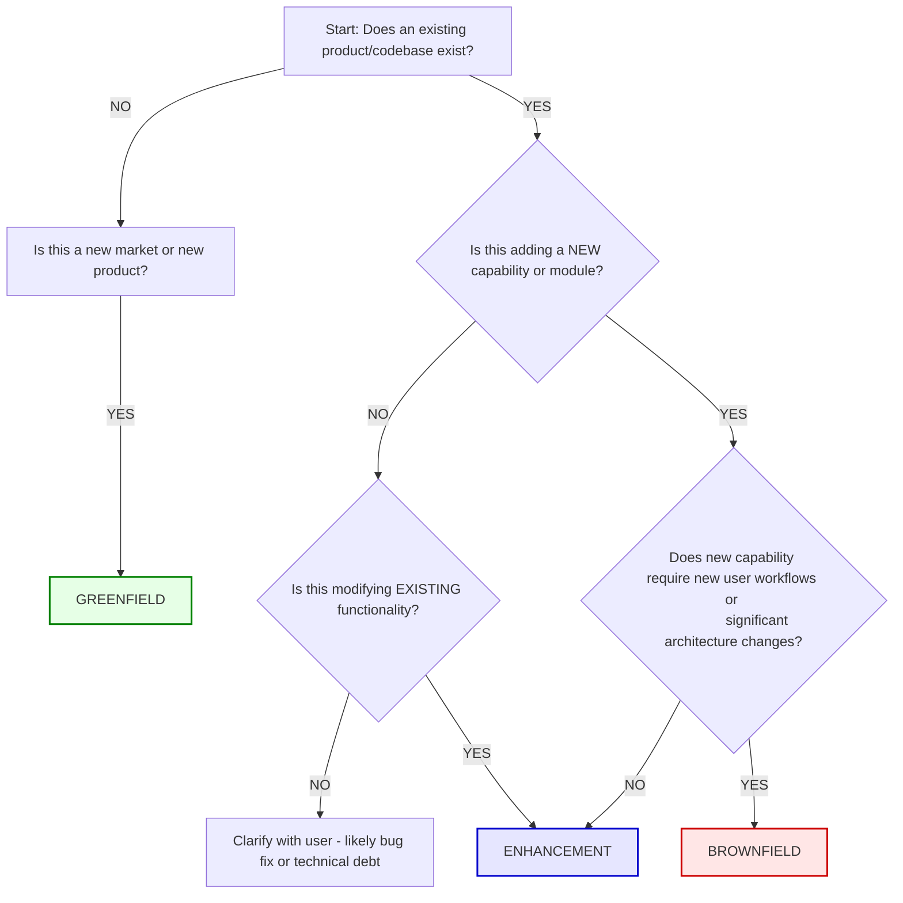

# Categorization Rules Playbook

## Purpose
Classify project context before any extraction or PRD work begins. Classification determines the depth of analysis, which hypothesis categories apply, and which PRD sections to include. The categorization gate is mandatory — never skip.

---

## Decision Tree




```
START
  │
  ├── Does an existing product/codebase exist?
  │     │
  │     ├── NO → Is this a new market or new product?
  │     │          │
  │     │          └── YES → GREENFIELD
  │     │
  │     └── YES → Is this adding a NEW capability or module?
  │                │
  │                ├── YES → Does the new capability require new user
  │                │         workflows or significant architecture changes?
  │                │          │
  │                │          ├── YES → BROWNFIELD
  │                │          └── NO → ENHANCEMENT
  │                │
  │                └── NO → Is this modifying EXISTING functionality?
  │                          │
  │                          ├── YES → ENHANCEMENT
  │                          └── NO → Clarify with user. Likely a bug fix
  │                                   or technical debt (out of scope for PRD).
```

---

## Classification Definitions

### Greenfield
**Definition:** New product, new market, or new standalone system. No existing codebase, no existing user base, no legacy constraints.

**Signals from transcript:**
- "We're building something from scratch"
- "New product line"
- "Entering a new market"
- No references to existing systems, databases, or user flows
- Discussion of customer discovery, market fit, competitive landscape

**Depth profile:**

| Dimension | Depth |
|-----------|-------|
| Customer segments | Full discovery — 3 personas |
| Problem validation | Full — hypothesis + experiment design |
| Solution hypothesis | Full — with 10x differentiation analysis |
| Channel/Revenue hypothesis | Full — pricing model + distribution |
| Competitor analysis | Required — in Appendix |
| Technical constraints | Architecture section with ADRs |
| Sharding | Full Epics + User Stories + Infrastructure Epics |
| Experiment design | Full for all HIGH-risk LOFAs |

### Brownfield
**Definition:** Existing product receiving a new capability, module, or significant extension. Existing codebase, existing users, existing constraints.

**Signals from transcript:**
- References to existing features ("Our current dashboard already...")
- Integration discussions ("This needs to connect to the existing API")
- User adoption concerns ("How do we get current users to use this?")
- Migration discussions ("What happens to existing data?")
- Backward compatibility mentions

**Depth profile:**

| Dimension | Depth |
|-----------|-------|
| Customer segments | Verify existing — 2 personas max |
| Problem validation | Light check — focus on the NEW problem |
| Solution hypothesis | Focused — include integration feasibility |
| Channel/Revenue hypothesis | Skip if same channel; address if new |
| Competitor analysis | Optional |
| Technical constraints | Integration constraints + dependency map |
| Sharding | Focused Epics + Integration Epic + Migration Epic |
| Experiment design | Focused on adoption and integration risk |

**Additional sections:**
- Integration Constraints (PRD Section 8)
- Migration Plan (Appendix)
- Backward Compatibility Matrix (Appendix)
- Adoption Hypothesis: "Existing users will adopt this because [reason]"

### Enhancement
**Definition:** Modification to existing functionality. Bug-driven improvement, performance optimization, UX refinement, or small feature addition within an existing module.

**Signals from transcript:**
- "Users have been asking for X in the existing [feature]"
- "The current [feature] doesn't handle [case]"
- "We need to improve [metric] on [existing feature]"
- Small scope, no new architecture, no new user flows
- References to specific existing UI elements, endpoints, or database tables

**Depth profile:**

| Dimension | Depth |
|-----------|-------|
| Customer segments | Skip — use existing |
| Problem validation | Skip — focus on metric impact |
| Solution hypothesis | Metric hypothesis only |
| Channel/Revenue hypothesis | Skip |
| Competitor analysis | Skip |
| Technical constraints | Change impact analysis |
| Sharding | User Stories only (skip Epic if ≤5 US) |
| Experiment design | A/B test or metric tracking only |

**Additional sections:**
- Change Impact Analysis (what existing behavior changes)
- Rollback Plan (how to revert if the change fails)
- Feature Flag Strategy (gradual rollout)

---

## Hybrid Scenarios

When classification is ambiguous, present the scenario to the user:

### Scenario: Greenfield module within brownfield product
"This appears to be a NEW module (no existing functionality to modify) within an EXISTING product (integration constraints apply). I recommend **Brownfield** classification with the following adjustments:
- Apply greenfield-depth customer and problem analysis for the new module
- Apply brownfield-depth integration and migration analysis for the system connection"

### Scenario: Enhancement that requires architecture change
"This change appears small in scope but requires significant architectural work. I recommend **Brownfield** classification because:
- The user-facing change is incremental (enhancement-like)
- But the technical change is substantial (brownfield-like infrastructure work)
- This affects sharding: needs both architecture Epics and feature US"

### Scenario: Multiple features spanning categories
"This transcript discusses multiple features at different scales. I recommend **classifying each feature separately:**
- Feature A: Greenfield (new product area)
- Feature B: Enhancement (improvement to existing)
- This produces two PRD documents or one PRD with clearly separated sections per classification."

---

## Categorization Questions

If the transcript is ambiguous, ask the user these questions (maximum 3):

1. "Does this work build on an existing product, or is it entirely new?"
2. "Will this change existing user workflows, or add new ones alongside existing ones?"
3. "Are there existing systems this must integrate with? If so, how critical is backward compatibility?"

Do NOT ask all 3 if the first answer clarifies. One question is often sufficient.

---

## Gate Protocol

**Input:** User's meeting transcript (raw or pre-processed)
**Output:** Classification label + depth profile confirmation

**Process:**
1. Scan the transcript for classification signals (see signal lists above).
2. Present your classification with evidence: "Based on [specific signals], I'm classifying this as [type]."
3. Show the depth profile table for confirmation.
4. Wait for user confirmation. If the user disagrees, adjust and re-confirm.

**Do NOT proceed to Phase 2 (Extract) until classification is confirmed.**
