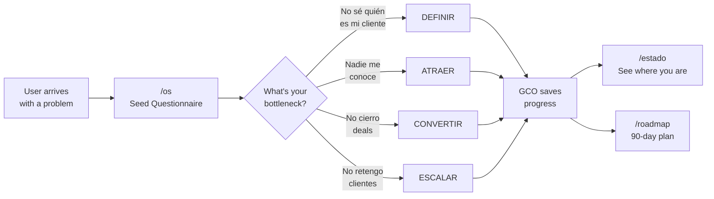
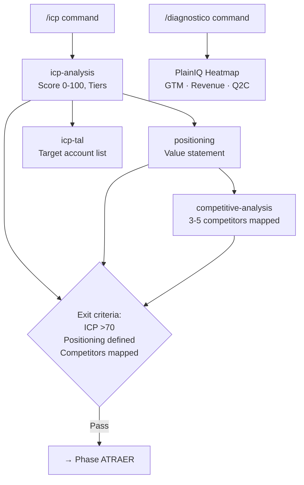
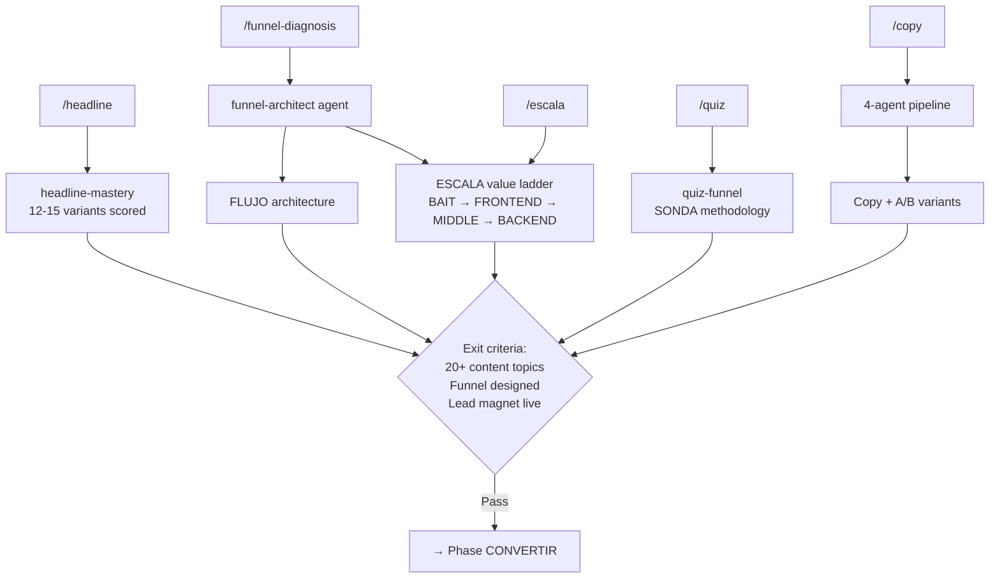
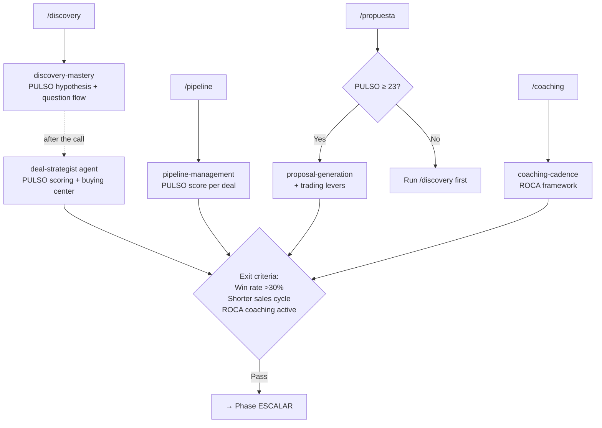
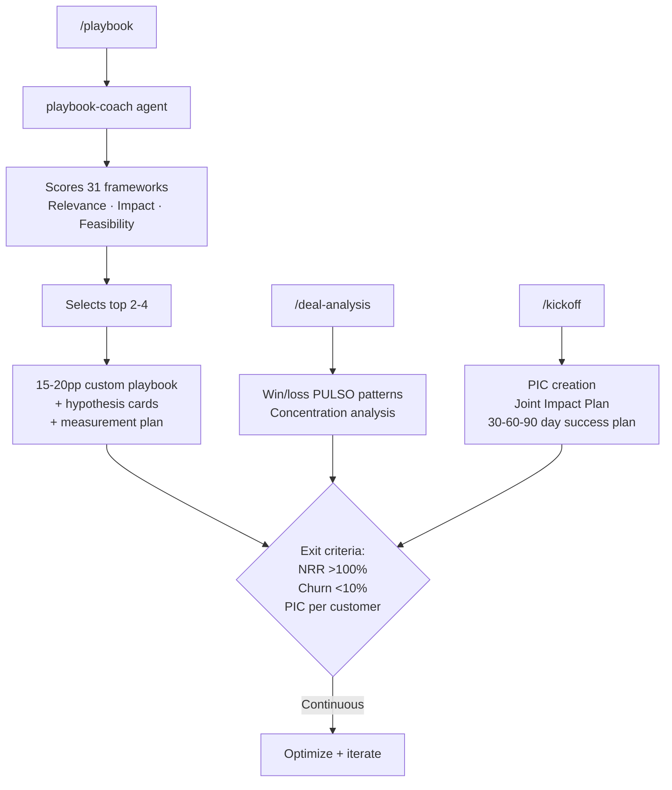
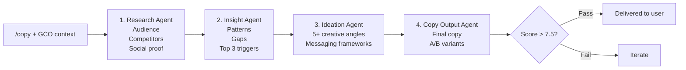

# GrowthOS — System Flow Map

> How input conversations flow through the system, which plugins activate, which agents trigger which skills, and how everything interconnects.
>
> Each diagram tells ONE story. Read them in order for the full picture.

---

## 1. The User Journey

Where does a user start, and what happens?



The system is **need-driven, not plugin-driven**. Users describe their problem. GrowthOS diagnoses the bottleneck and routes to the right phase automatically.

---

## 2. What Happens Inside Each Phase

### DEFINIR — "Who am I and who do I serve?"



### ATRAER — "How do I attract my ideal client?"



### CONVERTIR — "How do I close deals?"



### ESCALAR — "How do I retain and grow?"



---

## 3. The Copy Pipeline (Agent Orchestration Example)

The `/copy` command is the best example of how agents chain together:



---

## 4. How Data Flows Across Phases

Each phase's outputs become the next phase's inputs. The **GCO** (GrowthOS Context Object) is the transport layer. **PULSO** scores are the universal language.

```
DEFINIR outputs                    ATRAER consumes
├── ICP Profile (0-100)      →    content-strategy, quiz-funnel, escala
├── Positioning Statement    →    headline-mastery, copy agents, landing-pages
└── Competitive Landscape    →    content-strategy (differentiation angles)

ATRAER outputs                     CONVERTIR consumes
├── ESCALA Value Ladder      →    discovery-mastery (pricing context)
├── Content Plan             →    pre-discovery-research (thought leadership)
└── Funnel Blueprint         →    pipeline-management (conversion points)

CONVERTIR outputs                  ESCALAR consumes
├── PULSO Deal Scores        →    deal-analysis (win/loss patterns)
├── Pipeline Health          →    playbook-coach (problem classification)
├── Proposals                →    renewal-expansion (reference for upsell)
└── ROCA Coaching Data       →    sales-transformation (team capability)

ESCALAR outputs                    Feeds back to all phases
├── Playbook                 →    Updated methodology for DEFINIR+ATRAER
├── Win/Loss Patterns        →    Refined ICP scoring in DEFINIR
├── PIC (Joint Impact Plan)  →    Customer insights for ATRAER content
└── Measurement Plans        →    Quality gate calibration for all skills
```

---

## 5. Governance: Who Can Do What

The Agentic Constitution classifies every skill into trust zones:

| Zone | Autonomy | Skills | Rule |
|------|----------|--------|------|
| **GREEN** | Can graduate to autonomous | icp-analysis, competitive-analysis, plainiq-diagnostic, content-strategy, headline-mastery, pre-discovery | Low risk, formulaic |
| **YELLOW** | Always needs human review | positioning, product-marketing, alma, proposal-generation, email-sequences, coaching-cadence | Strategic choices |
| **RED** | Gated + human required | propuesta (PULSO ≥23), external comms, PII handling, budget decisions | High risk |

**Trust graduation**: HITL (default) → HOTL (after 50+ runs, 88% confidence, ≤8% escalation) → HOOTL (rare, zero violations)

---

## Quick Reference: Command Routing Table

| Command | Phase | Plugin | Agent(s) | Key Output |
|---------|-------|--------|----------|------------|
| `/os` | Any | conversational-pm | — | GCO initialized, phase routed |
| `/estado` | Any | conversational-pm | — | State dashboard |
| `/roadmap` | Any | conversational-pm | — | 90-day plan |
| `/diagnostico` | Any | growth-foundations | — | PlainIQ heatmap (0-40) |
| `/icp` | DEFINIR | growth-foundations | — | ICP profile (0-100, Tiers) |
| `/quiz` | ATRAER | growth-foundations | — | 6-question quiz (SONDA) |
| `/headline` | ATRAER | copywriting-engine | — | 12-15 headlines scored |
| `/copy` | ATRAER | copywriting-engine | 4 agents chained | Final copy + A/B variants |
| `/email-sequence` | ATRAER | copywriting-engine | — | 5-7 email cadence |
| `/escala` | ATRAER | motor-de-ofertas | — | Value ladder + LTV:CAC |
| `/funnel-diagnosis` | ATRAER | motor-de-ofertas | funnel-architect | Funnel blueprint |
| `/discovery` | CONVERTIR | sales-blueprint | deal-strategist (opt.) | Prep + PULSO hypothesis |
| `/pipeline` | CONVERTIR | sales-blueprint | — | Health dashboard |
| `/propuesta` | CONVERTIR | sales-blueprint | — | Proposal + trading levers |
| `/coaching` | CONVERTIR | sales-blueprint | — | Agenda + scripts (ROCA) |
| `/playbook` | ESCALAR | play-to-win | playbook-coach | 15-20pp playbook |
| `/deal-analysis` | ESCALAR | play-to-win | — | Win/loss PULSO patterns |
| `/kickoff` | ESCALAR | play-to-win | — | PIC + success plan |
